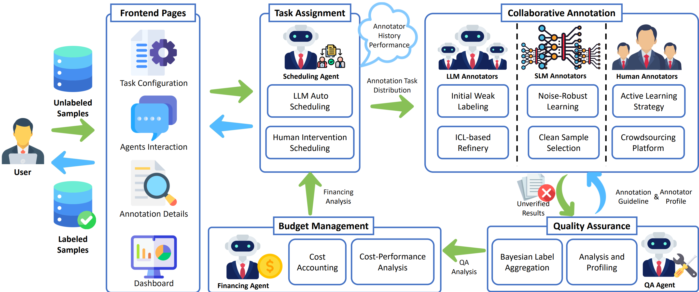

# CrowdAgent: Multi-Agent Managed Multi-Source Annotation System

This repository contains the official implementation for the system demo paper, **"CrowdAgent: Multi-Agent Managed Multi-Source Annotation System"**.

Our demonstration video is available at [https://youtu.be/fcnpanaEUqo](https://youtu.be/fcnpanaEUqo).

**Note:** This project is currently under development. The codebase and documentation are subject to change.

------

## 📖 Overview

High-quality annotated data is a cornerstone of modern Natural Language Processing (NLP). While recent methods leverage diverse annotation sources—including Large Language Models (LLMs), Small Language Models (SLMs), and human experts—they often lack the holistic **process control** required to manage these sources dynamically.

Inspired by real-world crowdsourcing companies, **CrowdAgent** is a multi-agent system that provides end-to-end process control over the entire data annotation lifecycle. It integrates task assignment, data annotation, and quality/cost management into a unified framework. By implementing a novel methodology that rationally assigns tasks, CrowdAgent enables LLMs, SLMs, and human experts to work synergistically, demonstrating superior efficiency and accuracy across diverse multimodal classification tasks.



This repository provides the source code for both the backend agent system and the frontend user interface.

## ✨ Key Features

- **Multi-Agent Framework:** Utilizes specialized agents for Scheduling, Quality Assurance (QA), and Financing to automate workflow management.

- **Multi-Source Annotation:** Synergistically combines LLMs, SLMs, and human experts to leverage their respective strengths.

- **Dynamic Process Control:** Moves beyond static rules, enabling intelligent, real-time task scheduling based on cost, quality, and annotator performance.

- **Interactive User Interface:** A user-friendly platform for task configuration, real-time monitoring of agent interactions, and visualization of key metrics.

## 🔗 Citation 

```
@inproceedings{qin-etal-2025-crowdagent,
    title = "{C}rowd{A}gent: Multi-Agent Managed Multi-Source Annotation System",
    author = "Qin, Maosheng  and
      Zhu, Renyu  and
      Xia, Mingxuan  and
      Chenchenkai  and
      Zhu, Zhen  and
      Lin, Minmin  and
      Zhao, Junbo  and
      Xu, Lu  and
      Fan, Changjie  and
      Wu, Runze  and
      Wang, Haobo",
    editor = {Habernal, Ivan  and
      Schulam, Peter  and
      Tiedemann, J{\"o}rg},
    booktitle = "Proceedings of the 2025 Conference on Empirical Methods in Natural Language Processing: System Demonstrations",
    month = nov,
    year = "2025",
    address = "Suzhou, China",
    publisher = "Association for Computational Linguistics",
    url = "https://aclanthology.org/2025.emnlp-demos.72/",
    pages = "925--942",
    ISBN = "979-8-89176-334-0",
    abstract = "High-quality annotated data is a cornerstone of modern Natural Language Processing (NLP). While recent methods begin to leverage diverse annotation sources{---}including Large Language Models (LLMs), Small Language Models (SLMs), and human experts{---}they often focus narrowly on the labeling step itself. A critical gap remains in the holistic process control required to manage these sources dynamically, addressing complex scheduling and quality-cost trade-offs in a unified manner. Inspired by real-world crowdsourcing companies, we introduce CrowdAgent, a multi-agent system that provides end-to-end process control by integrating task assignment, data annotation, and quality/cost management. It implements a novel methodology that rationally assigns tasks, enabling LLMs, SLMs, and human experts to advance synergistically in a collaborative annotation workflow. We demonstrate the effectiveness of CrowdAgent through extensive experiments on six diverse multimodal classification tasks. The source code and video demo are available at https://github.com/QMMMS/CrowdAgent."
}
```

